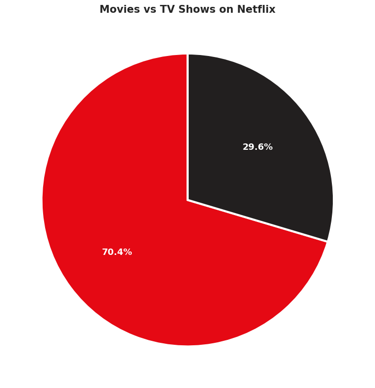
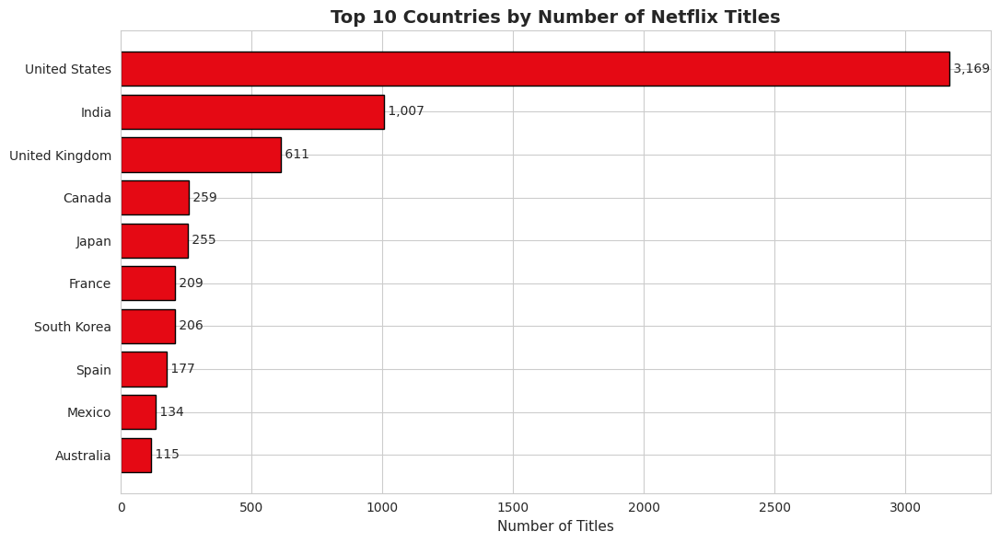
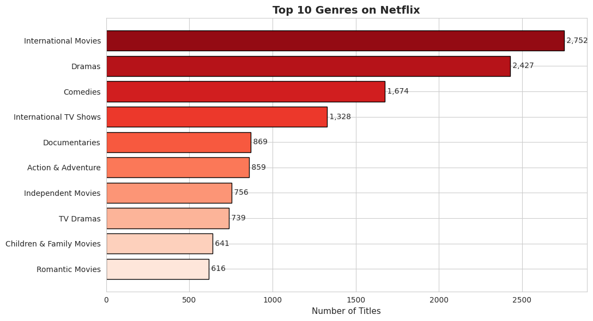
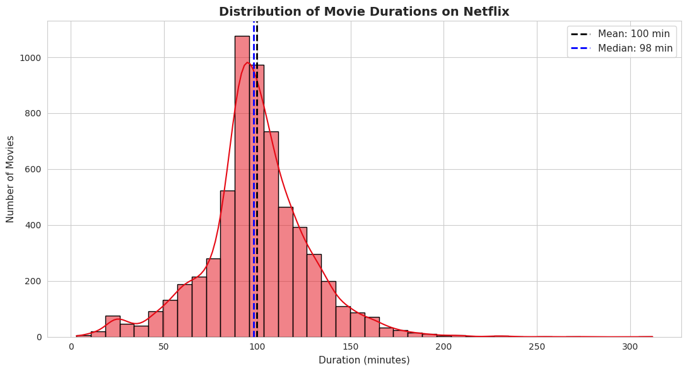
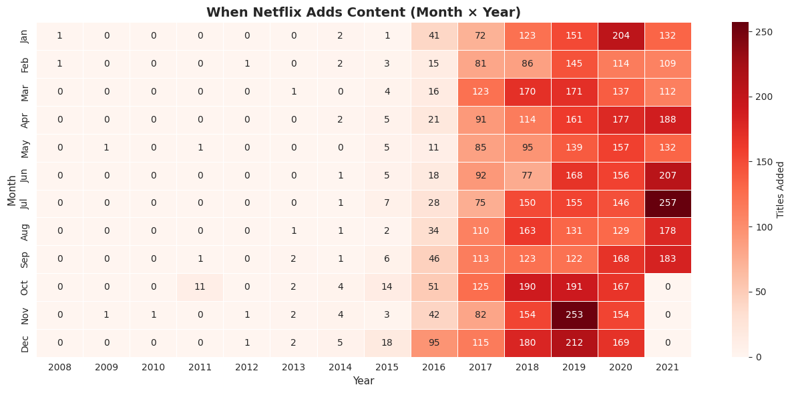

# 🎬 Netflix Content Analysis — How Netflix Conquered the World

**Course:** Data Analysis and Presentation with Python  
**Faculty of Engineering — AIE Program — Mansoura National University**  
**Spring Semester 2026**

---

## 📌 Project Description

This project performs a complete data-analysis workflow on the Netflix Movies & TV Shows catalog (~8,800 titles). We clean the data, engineer new features, and produce six different visualizations to tell the story of how Netflix grew into a global streaming giant.

## 🎯 Objectives

1. Clean and preprocess a real-world dataset (handling missing values, parsing dates, splitting multi-value columns)
2. Engineer new features for richer analysis
3. Conduct exploratory data analysis (EDA)
4. Produce six different chart types to tell a clear story
5. Communicate insights and recommendations

## 🛠️ Tools Used

| Tool | Purpose |
|---|---|
| **Pandas** | Data loading, cleaning, transformation |
| **NumPy** | Numerical computations |
| **Matplotlib** | Plotting |
| **Seaborn** | Statistical visualizations |
| **Jupyter Notebook** | Interactive development |

## 📊 Dataset

- **Source:** [Kaggle — Netflix Movies & TV Shows](https://www.kaggle.com/datasets/shivamb/netflix-shows)
- **File:** `netflix_titles.csv`
- **Size:** ~8,800 titles
- **Columns:** show_id, type, title, director, cast, country, date_added, release_year, rating, duration, listed_in, description

## 🚀 How to Run

1. **Clone the repository**
   ```bash
   git clone https://github.com/<your-username>/netflix-analysis.git
   cd netflix-analysis
   ```

2. **Download the dataset** from [Kaggle](https://www.kaggle.com/datasets/shivamb/netflix-shows) and place `netflix_titles.csv` in the project folder.

3. **Install the required libraries**
   ```bash
   pip install pandas numpy matplotlib seaborn jupyter
   ```

4. **Open the notebook**
   ```bash
   jupyter notebook Netflix_Analysis.ipynb
   ```

5. **Run all cells** — `Cell ▸ Run All` from the menu, or `Shift+Enter` cell-by-cell.

## 📈 Visualizations Included

1. **Pie Chart** — Movies vs TV Shows split
2. **Line Chart** — Netflix content growth over the years
3. **Horizontal Bar Chart** — Top 10 countries producing Netflix content
4. **Horizontal Bar Chart** — Most popular genres
5. **Histogram** — Movie duration distribution
6. **Heatmap** — When Netflix adds content (Month × Year)

## 🔍 Key Insights

- Movies dominate the catalog (~70%), but TV Shows have grown rapidly since 2016.
- 2018–2019 was Netflix's peak expansion period.
- The US, India, and UK are the top 3 content-producing countries.
- International Movies and Dramas are the most common genres.
- The typical Netflix movie is 90–110 minutes long.
- Netflix adds more content during the holiday season (Oct–Jan).

## 📁 Repository Structure

```
Netflix_Content_Analysis_Project/
├── Netflix_Analysis.ipynb      # Main analysis notebook
├── netflix_titles.csv          # Raw dataset (download from Kaggle)
├── README.md                   # This file
└── screenshots/                # Charts and screenshots
```

## 👥 Team Members

- *Mohmed Ali Ali Shatla <--------  team Leader*
- *Mohamed Osama Kamel*
- *Ibrahim Mohamed Mohamed Amin*
- *Mahmoud ashraf hosny el lakany*
- *Badr Islam ibrahim elewa*
- *Mohamed Ashraf Fawzi Al-Danin*
- *Mohamed Sherif Bahi Jabal*

## 📷 Screenshots

<p align="center">
  
  
  
  
  
</p>
---

**Submitted to:** Assoc.Prof. Hanaa ZainEldin

